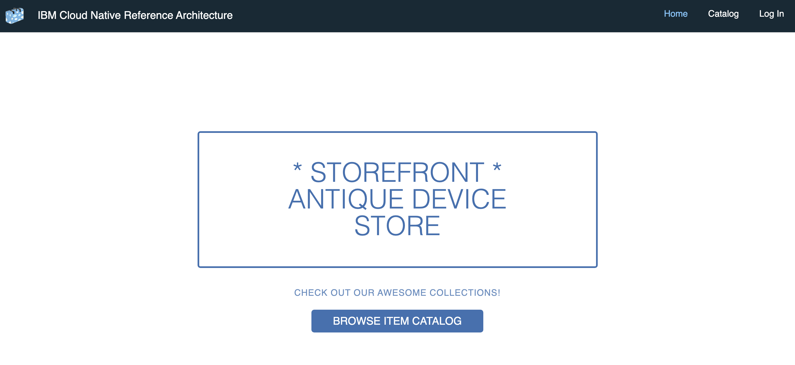
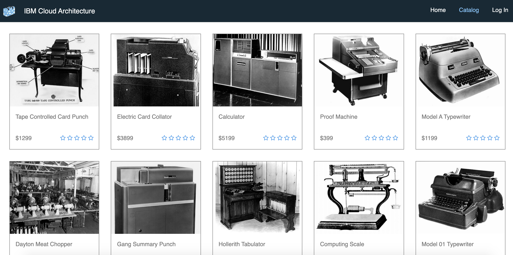
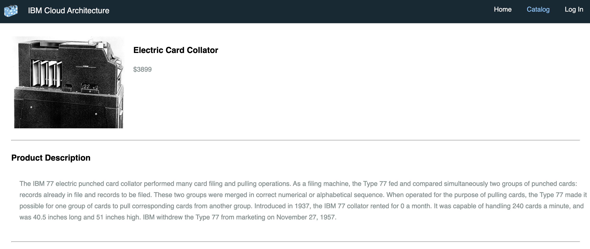
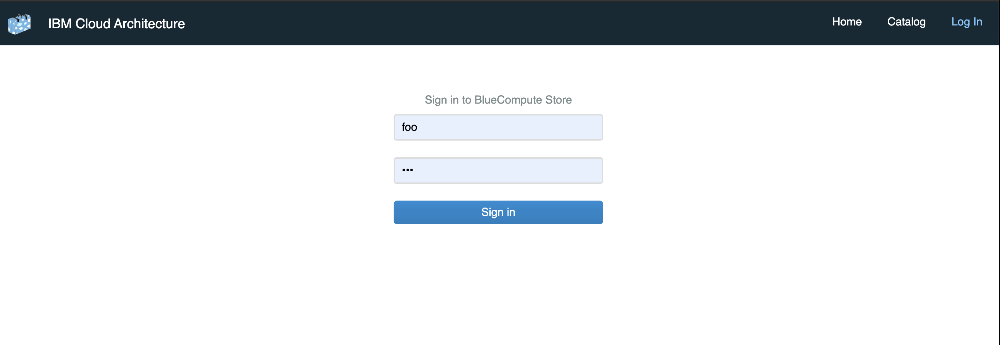
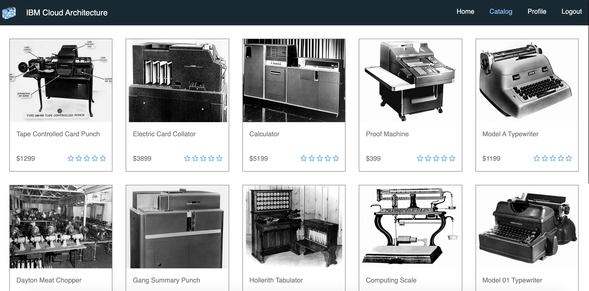
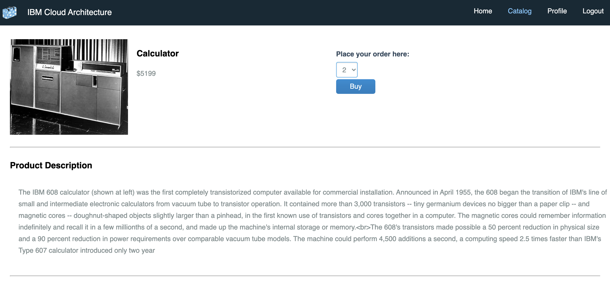
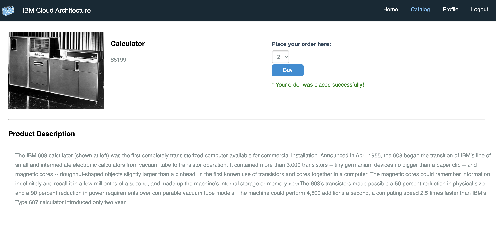
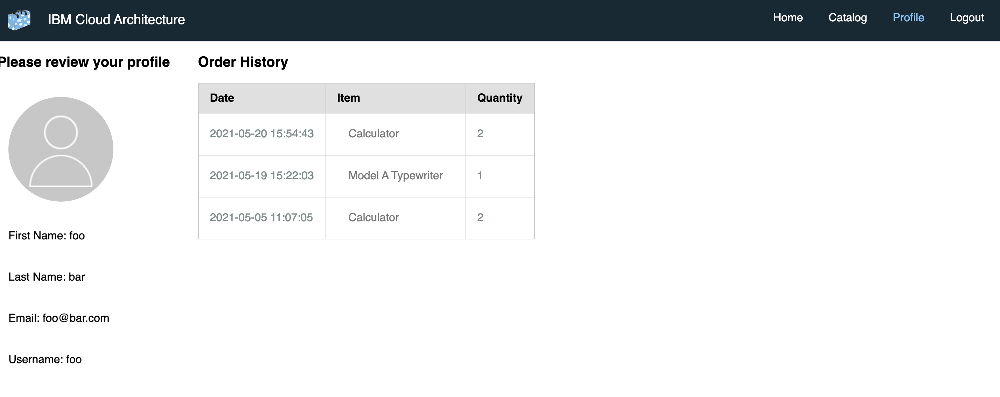
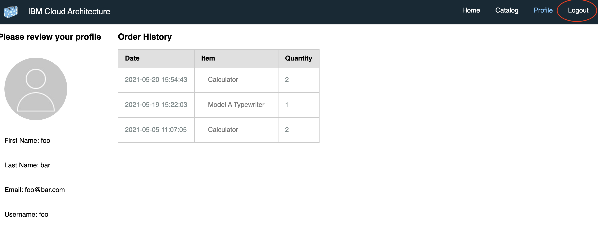

- Open the storefront ui.

- Click on `BROWSE ITEM CATALOG`

- Click on any of the product from the catalog.

- Login using your credentials.

- Home screen after login looks like below.

- Place the orders.

- After successfully placing the order, you will see something like below.

- User information will be displayed in the profile section.

- Finally, logout as below.

